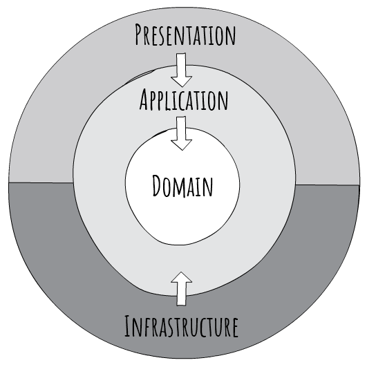
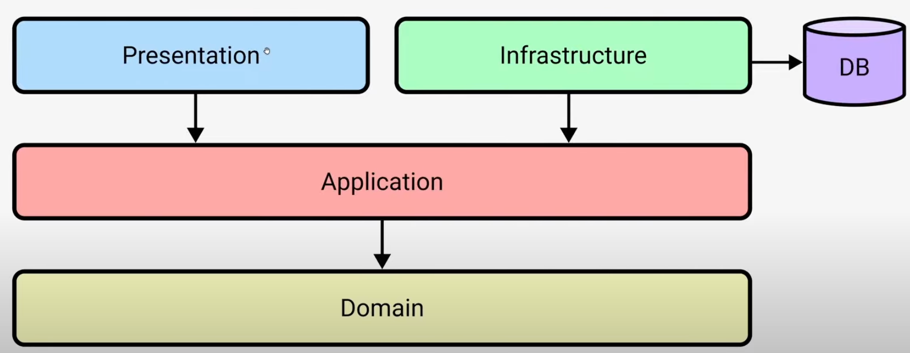
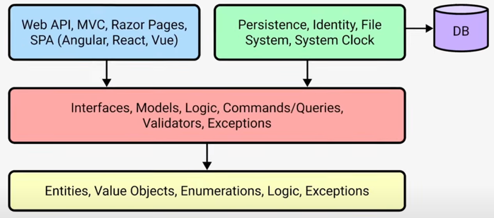

# Buber Dinner

## The idea

Allows you to turn your home into a restaurant where...
Just like people turning their homes into hotels via AirBNB.

Watch these YouTube vidoes for the background.

This project is also a sample for [FunctionalDDD](https://github.com/xavierjohn/FunctionalDDD) which is a library that helps you to implement Domain-Driven Design in a functional way.

## Concepts & Tech used

* .NET 7, EF Core
* Clean Architecture & Domain-Driven Design principles
* Common patterns such as CQRS, unit of work, repository, mediator
* Open source libraries such as Mediator, FluentValidation, FunctionalDDD, Mapster
* Authentication: JWT tokens

### Clean Architecture

* The **Domain** and **Application** layers are the focus and therefore the core of the system.
* The **Domain** layer contains **business logic**, **AggregateRoot**, **Entities** and **ValueObjects**.
* The **Application** layer contains **business logic** and glue to combine Infrastructure & Domain.
* The **Infrastructure** layer contains glue code to connect the application to the outside world. It contains implementations of interfaces defined in the Application layer.
* The **Presentation** layer is the entry point to the system. It is responsible for **translating HTTP requests** into commands and queries for the application layer to handle.
