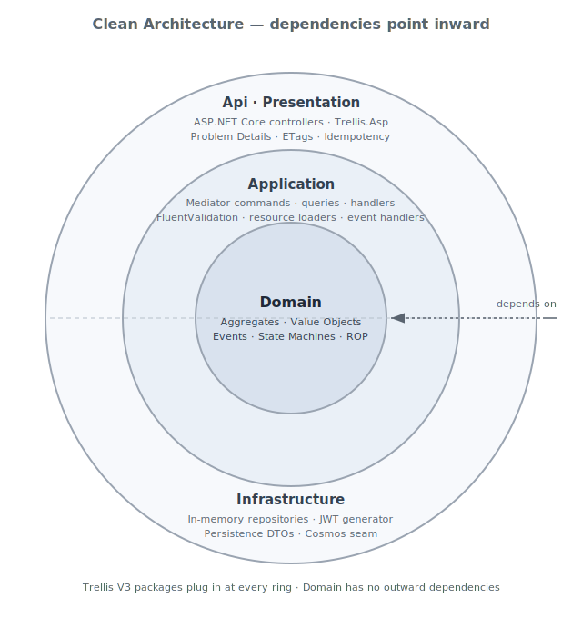
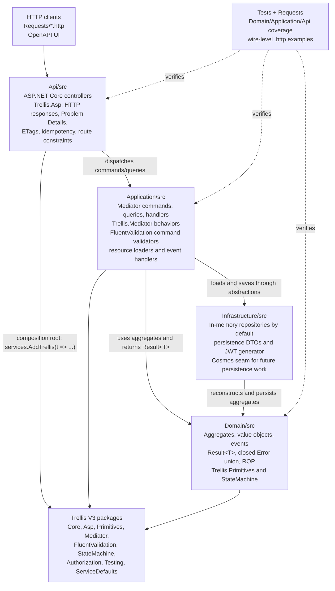
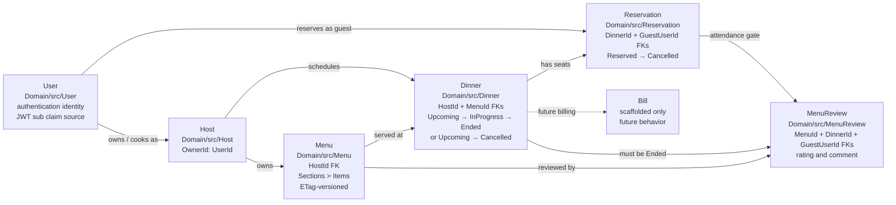

# BuberDinner

BuberDinner is a reference application for evaluating and learning the Trellis V3 stack in a realistic dinner-hosting marketplace: a user becomes a host, publishes menus, schedules dinners, guests reserve seats, and attendees review the menu afterward. It is still a Clean Architecture sample, but the current purpose is more specific: show how Trellis 3.0.0-alpha.342 fits across Domain, Application, Infrastructure, API, and tests on .NET 10.

## What it demonstrates

- **Trellis Core**: `Result<T>`, railway-oriented programming (ROP), the closed `Error` union, `Aggregate<TId>`, and `ResourceRef`.
- **ASP.NET boundaries**: `ToHttpResponseAsync()`, RFC-7807 Problem Details, strong ETags, precondition handling, and idempotency middleware.
- **Typed primitives**: `RequiredString<TSelf>`, `RequiredEnum<TSelf>`, typed scalar value-object route constraints such as `{hostId:HostId}`.
- **CQRS with source-generated Mediator**: NuGet `Mediator` plus `Trellis.Mediator` pipeline behaviors; this project does not use MediatR.
- **Validation at the right boundaries**: FluentValidation inside domain factories and command-boundary validation via `Trellis.Mediator.FluentValidation`.
- **State machines**: `Trellis.StateMachine` over Stateless for dinner and reservation lifecycles, with transitions returning `Result<T>`.
- **Resource-based authorization**: `IAuthorizeResource<TResource>`, `IIdentifyResource<TResource,TId>`, and `SharedResourceLoaderById` for host-owned resources.
- **Testing support**: `Trellis.Testing` FluentAssertions matchers such as `.Should().BeSuccess()`, `.BeFailureOfType<>()`, and `.Unwrap()`.
- **Service composition**: `services.AddTrellis(t => t.Use*(...))` via `Trellis.ServiceDefaults` in the API composition root.
- **Persistence seam**: in-memory repositories by default, with the repository abstractions and DTO layer structured for future EF Core/Cosmos implementations.

## Current stack

| Concern | Current choice |
|---|---|
| Runtime | .NET 10, pinned by `global.json` to SDK `10.0.300` with `rollForward: latestFeature`. |
| Trellis | `3.0.0-alpha.342` through central package management in `Directory.Packages.props`. |
| HTTP/API | ASP.NET Core 10 controllers, API versioning, Swashbuckle/OpenAPI UI, JWT bearer auth. |
| CQRS | NuGet `Mediator` (`Mediator.Abstractions` + `Mediator.SourceGenerator`), not MediatR. |
| Validation | FluentValidation in domain factories and command-boundary validators. |
| Persistence | In-memory repositories by default; Cosmos support remains behind the `Persistence=CosmosDb` setting and falls back to in-memory for aggregates not yet implemented there. |
| Tests | xUnit, FluentAssertions, `Trellis.Testing`, and ASP.NET Core integration tests. |

### Trellis packages in use

| Package | Role in this repo |
|---|---|
| `Trellis.Core` | `Result<T>`, ROP operators, `Error`, `Aggregate<TId>`, `ResourceRef`. |
| `Trellis.Asp` | `ToHttpResponseAsync()`, Problem Details, ETags, route constraints, idempotency middleware. |
| `Trellis.Primitives` | Required value-object bases and scalar VO binding support. |
| `Trellis.Mediator` | Logging/tracing/exception/domain-event/resource-auth pipeline behaviors. |
| `Trellis.Mediator.FluentValidation` | Auto-wired `IValidator<TCommand>` validation behavior. |
| `Trellis.FluentValidation` | `IValidator<T>.ValidateToResult()` bridge used inside factories. |
| `Trellis.StateMachine` | Stateless adapter with `LazyStateMachine<,>` and `FireResult(...)`. |
| `Trellis.Http.Abstractions` | Direct dependency of `Application` for HTTP-shape primitives used by handlers. |
| `Trellis.Authorization` | Resource authorization contracts and shared resource loader base (pulled in transitively via `Trellis.Mediator`). |
| `Trellis.Testing` | FluentAssertions matchers for `Result<T>`. |
| `Trellis.ServiceDefaults` | Fluent `services.AddTrellis(t => t.Use*(...))` registration. |

## Quickstart

Prerequisite: .NET SDK 10.0.300 or a compatible .NET 10 preview SDK.

```powershell
dotnet build
```

```powershell
dotnet test
```

`dotnet test` runs the domain, application, API, and infrastructure test projects. The current suite is 120 tests in the in-memory path (Domain 45, Application 1, Api 74); two Infrastructure live-database socket tests are a known pre-existing failure when no backing database is available.

```powershell
dotnet run --project Api\src\BuberDinner.Api.csproj
```

The `InMemory` launch profile starts the API at `https://localhost:7059`. Unless `Persistence=CosmosDb` is set, the app uses in-memory repositories and is ready for local exploration. The root route hosts the OpenAPI UI configured by `UseSwaggerUI()`.

## Tour: the Trellis V3 showcase arc

The repository was built up through seven merged PRs. The docs use local showcase numbering for the feature walkthroughs after the migration PR.

| GitHub PR | Theme | What changed | Walkthrough |
|---|---|---|---|
| #26 | FunctionalDDD to Trellis V3 | Migrated to .NET 10, Trellis V3, closed `Error` union, `Result.Ok`/`Result.Fail`, `ToHttpResponseAsync()`, and `AddTrellisBehaviors`. | [Docs/MIGRATION_TO_TRELLIS_V3.md](Docs/MIGRATION_TO_TRELLIS_V3.md) |
| #27 | HTTP preconditions and resource auth | Added `Host`, strong ETags, `If-None-Match`, `If-Match`, 428/412 responses, `IAuthorizeResource<Host>`, and scalar VO route constraints. | [Docs/PR1_ETAG_AND_RESOURCE_AUTH.md](Docs/PR1_ETAG_AND_RESOURCE_AUTH.md) |
| #28 | Dinner lifecycle | Added `Dinner`, a Stateless-backed state machine, transition commands, and domain events: `DinnerScheduled`, `DinnerStarted`, `DinnerEnded`, `DinnerCancelled`. | [Docs/PR2_DINNER_STATE_MACHINE.md](Docs/PR2_DINNER_STATE_MACHINE.md) |
| #29 | Cursor pagination | Added Trellis `Page<T>`, `Cursor`, `PageBuilder.FromOverFetch`, paged menu/dinner list endpoints, and `Link: rel="next"` headers. | [Docs/PR3_PAGINATION.md](Docs/PR3_PAGINATION.md) |
| #30 | Reservations and idempotency | Added `Reservation`, idempotent reservation creation with `Idempotency-Key`, replay/fingerprint behavior, and fail-loud related-aggregate loading. | [Docs/PR4_RESERVATIONS_AND_IDEMPOTENCY.md](Docs/PR4_RESERVATIONS_AND_IDEMPOTENCY.md) |
| #31 | Reviews and defaults | Added `MenuReview`, command-boundary FluentValidation, `Trellis.Testing` examples, and the `AddTrellis(t => ...)` ServiceDefaults composition builder. | [Docs/PR5_REVIEWS_FLUENTVALIDATION_TESTING_DEFAULTS.md](Docs/PR5_REVIEWS_FLUENTVALIDATION_TESTING_DEFAULTS.md) |
| #32 | ROP refactor sweep | Converted load-check-act seams and `TryCreate` factories to `.ToResult().Ensure().BindAsync().TapAsync()` and `ValidateToResult(...).Map(...)` chains. | [SubmitMenuReviewCommandHandler.cs](Application/src/MenuReviews/Commands/SubmitMenuReviewCommandHandler.cs) |

## Architecture

The codebase follows Clean Architecture: Domain at the centre, Application around it, then Infrastructure and Api on the outside. Dependencies always point inward — `Domain` has no outward references, `Application` references `Domain`, and `Infrastructure` + `Api` implement abstractions defined further inside.



The same picture, as a runtime flow showing how a request travels through the layers and where each Trellis package plugs in:


```mermaid
flowchart TB
    Client["HTTP clients<br/>Requests/*.http<br/>OpenAPI UI"]
    ApiLayer["Api/src<br/>ASP.NET Core controllers<br/>Trellis.Asp: HTTP responses, Problem Details,<br/>ETags, idempotency, route constraints"]
    ApplicationLayer["Application/src<br/>Mediator commands, queries, handlers<br/>Trellis.Mediator behaviors<br/>FluentValidation command validators<br/>resource loaders and event handlers"]
    DomainLayer["Domain/src<br/>Aggregates, value objects, events<br/>Result&lt;T&gt;, closed Error union, ROP<br/>Trellis.Primitives and StateMachine"]
    InfrastructureLayer["Infrastructure/src<br/>In-memory repositories by default<br/>persistence DTOs and JWT generator<br/>Cosmos seam for future persistence work"]
    Tests["Tests + Requests<br/>Domain/Application/Api coverage<br/>wire-level .http examples"]
    Trellis["Trellis V3 packages<br/>Core, Asp, Primitives, Mediator,<br/>FluentValidation, StateMachine,<br/>Authorization, Testing, ServiceDefaults"]

    Client --> ApiLayer
    ApiLayer -->|"dispatches commands/queries"| ApplicationLayer
    ApplicationLayer -->|"loads and saves through abstractions"| InfrastructureLayer
    ApplicationLayer -->|"uses aggregates and returns Result&lt;T&gt;"| DomainLayer
    InfrastructureLayer -->|"reconstructs and persists aggregates"| DomainLayer
    ApiLayer -->|"composition root: services.AddTrellis(t => ...)"| Trellis
    ApplicationLayer --> Trellis
    DomainLayer --> Trellis
    Tests -. verifies .-> ApiLayer
    Tests -. verifies .-> ApplicationLayer
    Tests -. verifies .-> DomainLayer
```

The dependency direction stays conventional: API depends on Application, Application depends on Domain abstractions and repository interfaces, Infrastructure implements those interfaces, and Domain stays pure C#.

## Aggregate relationships


```mermaid
flowchart LR
    User["User<br/>Domain/src/User<br/>authentication identity<br/>JWT sub claim source"]
    Host["Host<br/>Domain/src/Host<br/>OwnerId: UserId"]
    Menu["Menu<br/>Domain/src/Menu<br/>HostId FK<br/>Sections &gt; Items<br/>ETag-versioned"]
    Dinner["Dinner<br/>Domain/src/Dinner<br/>HostId + MenuId FKs<br/>Upcoming → InProgress → Ended<br/>or Upcoming → Cancelled"]
    Reservation["Reservation<br/>Domain/src/Reservation<br/>DinnerId + GuestUserId FKs<br/>Reserved → Cancelled"]
    MenuReview["MenuReview<br/>Domain/src/MenuReview<br/>MenuId + DinnerId + GuestUserId FKs<br/>rating and comment"]
    Bill["Bill<br/>scaffolded only<br/>future behavior"]

    User -- "owns / cooks as" --> Host
    Host -- "owns" --> Menu
    Host -- "schedules" --> Dinner
    Menu -- "served at" --> Dinner
    User -- "reserves as guest" --> Reservation
    Dinner -- "has seats" --> Reservation
    Reservation -- "attendance gate" --> MenuReview
    Dinner -- "must be Ended" --> MenuReview
    Menu -- "reviewed by" --> MenuReview
    Dinner -. "future billing" .-> Bill
```

| Aggregate | Lives at | Purpose |
|---|---|---|
| `User` | `Domain/src/User/` | Authentication identity and JWT `sub` claim source. |
| `Host` | `Domain/src/Host/` | A user wearing the "I cook" hat; owns menus and dinners. |
| `Menu` | `Domain/src/Menu/` | Recipe set a host can serve; hierarchical sections/items; ETag-versioned. |
| `Dinner` | `Domain/src/Dinner/` | Scheduled occurrence of a menu; state machine plus transition domain events. |
| `Reservation` | `Domain/src/Reservation/` | A guest's seat claim for a dinner; idempotent creation and cancellable lifecycle. |
| `MenuReview` | `Domain/src/MenuReview/` | Rating/comment from a guest who actually attended; gated by dinner/reservation state. |
| `Bill` | `Docs/DomainModels/Aggregates.Bill.md` | Scaffolded for future behavior; not implemented as a domain aggregate yet. |

## API surface at a glance

All application endpoints live under the `Api/src/2022-12-21/` controller folder (the date is a source-tree namespace, not the wire version) and expose API version **`2022-10-01`** via `[ApiVersion("2022-10-01")]`. Pass `?api-version=2022-10-01` on every call. Authentication is version-neutral.

| Area | Endpoint family | What to look for |
|---|---|---|
| Authentication | `POST /authentication/register`, `POST /authentication/login` | Creates `User`, issues JWTs, maps login failures to structured errors. |
| Hosts | `POST /hosts` | Creates a `Host` for the authenticated user; owner comes from JWT `sub`. |
| Menus | `/hosts/{hostId:HostId}/menus` | Typed route params, create/get/list/update, strong ETags, conditional GET, `If-Match` updates. |
| Dinners | `/hosts/{hostId:HostId}/dinners` | Schedule/list/get plus `start`, `end`, and `cancel` transition endpoints. |
| Reservations | `/reservations`, `/reservations/mine`, dinner reservation lists | Idempotent create, guest-only get/cancel, host-only dinner reservation listing. |
| Reviews | `/menu-reviews` | Submit/update/get/list reviews with command-boundary validation and attendance gating. |

Important failure modes are first-class examples, not edge cases hidden in tests: 428 missing precondition, 412 stale ETag, 422 validation or rule-code failures, 404 leak shields, 401/403 auth failures, 304 conditional GET, and idempotency 400/422 responses.

## Cross-cutting patterns

| Pattern | How it appears here | See |
|---|---|---|
| Result + ROP everywhere | Load-check-act seams compose with `.ToResult()`, `.Ensure()`, `.BindAsync()`, and `.TapAsync()` instead of nested `if`/throw flows. | [SubmitMenuReviewCommandHandler.cs](Application/src/MenuReviews/Commands/SubmitMenuReviewCommandHandler.cs) |
| Closed `Error` union | `NotFound`, `InvalidInput`, `Forbidden`, `AuthenticationRequired`, `Unexpected`, and `Conflict` flow to RFC-7807 responses through `ToHttpResponseAsync()`. | [Migration notes](Docs/MIGRATION_TO_TRELLIS_V3.md) |
| ETag preconditions | GET emits strong ETags; update requires `If-Match`; stale writes return 412 and missing preconditions return 428. | [PR #27 walkthrough](Docs/PR1_ETAG_AND_RESOURCE_AUTH.md) |
| Cursor pagination | List endpoints over-fetch `pageSize.Applied + 1` and let `PageBuilder.FromOverFetch` detect whether a next cursor exists. | [PR #29 walkthrough](Docs/PR3_PAGINATION.md) |
| State machines | Dinner and Reservation transitions use `LazyStateMachine<TStatus,TTrigger>` and `FireResult(trigger).Map(...)`. | [PR #28 walkthrough](Docs/PR2_DINNER_STATE_MACHINE.md) |
| Idempotency | `[Idempotent]` reservation creation replays the same `201` for the same key/body and returns 422 for fingerprint mismatches. | [PR #30 walkthrough](Docs/PR4_RESERVATIONS_AND_IDEMPOTENCY.md) |
| Leak-shielded 404s | Non-owning callers receive `NotFound` with detail instead of 403 when existence should not be revealed. | [Reservations](Docs/PR4_RESERVATIONS_AND_IDEMPOTENCY.md), [Reviews](Docs/PR5_REVIEWS_FLUENTVALIDATION_TESTING_DEFAULTS.md) |
| Command-boundary validation | `IValidator<TCommand>` classes are discovered by `UseFluentValidation(...)` and fail before handlers run. | [PR #31 walkthrough](Docs/PR5_REVIEWS_FLUENTVALIDATION_TESTING_DEFAULTS.md) |
| ServiceDefaults composition | The API registers Trellis through `services.AddTrellis(t => t.UseAsp().UseProblemDetails().UseMediator()...)`. | [Api/src/DependencyInjection.cs](Api/src/DependencyInjection.cs) |

## Where to look for common tasks

| Task | Starting point |
|---|---|
| See the API composition root | [Api/src/DependencyInjection.cs](Api/src/DependencyInjection.cs) |
| See the standard controller pattern | [Api/src/2022-12-21/Controllers/MenusController.cs](Api/src/2022-12-21/Controllers/MenusController.cs) |
| Follow a multi-gate ROP handler | [Application/src/MenuReviews/Commands/SubmitMenuReviewCommandHandler.cs](Application/src/MenuReviews/Commands/SubmitMenuReviewCommandHandler.cs) |
| Study state-machine aggregates | [Domain/src/Dinner/Entities/Dinner.cs](Domain/src/Dinner/Entities/Dinner.cs), [Domain/src/Reservation/Entities/Reservation.cs](Domain/src/Reservation/Entities/Reservation.cs) |
| Study command-boundary validators | [Application/src/MenuReviews/Validators/](Application/src/MenuReviews/Validators/) |
| Study typed value objects | `Domain/src/*/ValueObject/` and `Domain/src/*/ValueObjects/` |
| Study in-memory persistence | [Infrastructure/src/Persistence/Memory/](Infrastructure/src/Persistence/Memory/) |
| Study domain tests using Trellis matchers | [Domain/tests/MenuReviewTests.cs](Domain/tests/MenuReviewTests.cs) |
| Read the bundled Trellis API docs | [.github/trellis-api-*.md](.github/) |

## Project layout

```text
Domain/          Pure C#: aggregates, value objects, events, state machines, and domain FluentValidation rules.
Application/     Mediator commands/queries/handlers, resource loaders, validators, event handlers, repository interfaces.
Infrastructure/  In-memory repositories, persistence DTOs, optional Cosmos seam, JWT token generation.
Api/             ASP.NET Core controllers, OpenAPI/Swagger, auth, versioning, and Trellis composition root.
Requests/        30 .http files that exercise happy paths and failure modes end-to-end.
Docs/            Migration notes, PR walkthroughs, and per-aggregate domain notes.
.github/         Bundled Trellis API reference docs used by the showcase; not application runtime code.
build/           Repository build support.
```

## Replay all the .http files

The `Requests/` directory is organized by feature area and can be used with the VS Code REST Client or JetBrains HTTP Client. The files cover the happy path plus important failure modes: 428 missing precondition, 412 stale ETag, 422 validation/rule codes, 404 leak shields, 401/403 auth, 304 conditional GET, and idempotency 400/422 responses.

Run the API with a fresh in-memory store, then execute the requests in dependency order: authentication, host, menu, dinner, reservation, review. The durable automated coverage is the API integration test project, so `dotnet test` remains the primary verification command — it exercises the same endpoints end-to-end without any manual replay step.

## Credits and history

BuberDinner started as a Clean Architecture and DDD tutorial codebase for a home-restaurant idea, inspired by the original [REST API following Clean Architecture & DDD tutorial series](https://www.youtube.com/watch?v=fhM0V2N1GpY&list=PLzYkqgWkHPKBcDIP5gzLfASkQyTdy0t4k). This repository has since evolved into an end-to-end Trellis V3 reference application through the seven merged PRs summarized above.